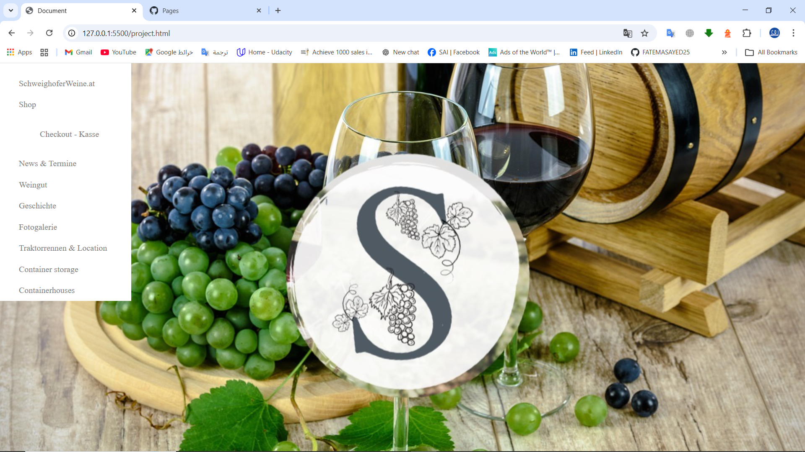
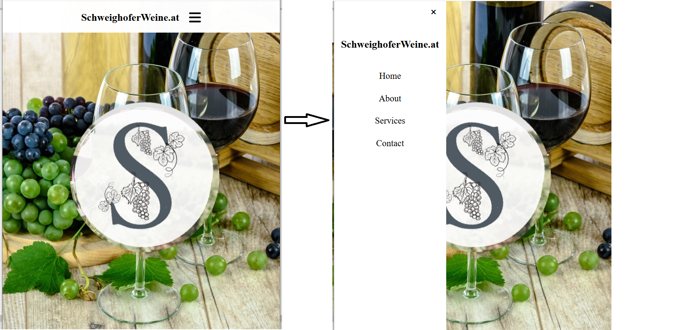

# SchweighoferWeine.at – CSS Editing Project

## Project Overview

This project focuses on redesigning and improving the navigation layout and responsive behavior of the **SchweighoferWeine.at** website using **HTML**, **CSS**, and responsive design techniques.

The goal of the editing process was to transform the old fixed sidebar navigation into a cleaner and more modern responsive mobile navigation menu.

---

# Technologies Used

* HTML5
* CSS3
* Responsive Design
* Flexbox
* Media Queries
* JavaScript (for menu toggle interaction)

---

# Main Improvements

## 1. Responsive Navigation Bar

The original website used a vertical sidebar menu that occupied space on the left side of the page.

### Before Editing

* Large sidebar navigation
* Not optimized for mobile screens
* Content area reduced because of sidebar width
* missy menu items

### After Editing

* Responsive top navigation bar
* Hamburger menu for mobile devices
* Cleaner user experience
* Better mobile responsiveness
* Modern fullscreen sliding menu

---

# Project Screenshots

## Original Layout

---

## Edited Responsive Layout

---

# Features Added

* Mobile-friendly navigation
* Toggle menu animation
* Better spacing and alignment
* Improved visual hierarchy
* Simplified user interaction
* Responsive fullscreen menu panel

---

# Author
Fatema Sayed
Created as a frontend CSS editing and responsive redesign practice project.
